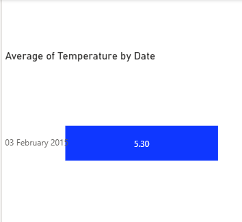
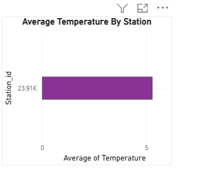
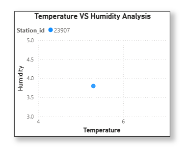
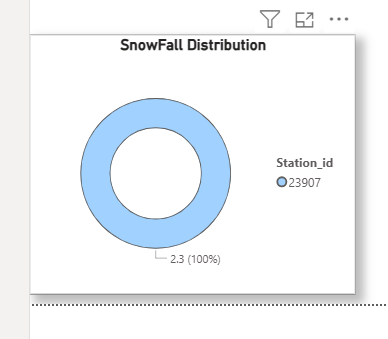
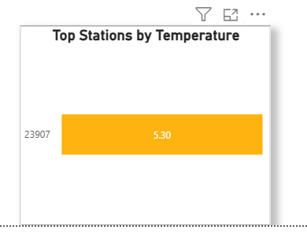
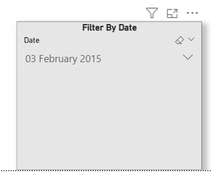

# Weather Analysis Dashboard

This project analyzes weather data using Python, SQL, and Power BI.

## Technologies Used
- Python
- SQL
- Power BI
- Pandas
- NumPy

## Features
- Weather Data Cleaning
- SQL Database Integration
- Interactive Dashboard
- Temperature Analysis
- Rainfall Insights
- Humidity Analysis
- Weather Trend Visualization

---

# Dashboard Screenshots

## Average Temperature by Date

## Average Temperature by Station

## Temperature VS Humidity

## Snowfall Distribution

## Top Stations by Temperature

## Filter By Date

